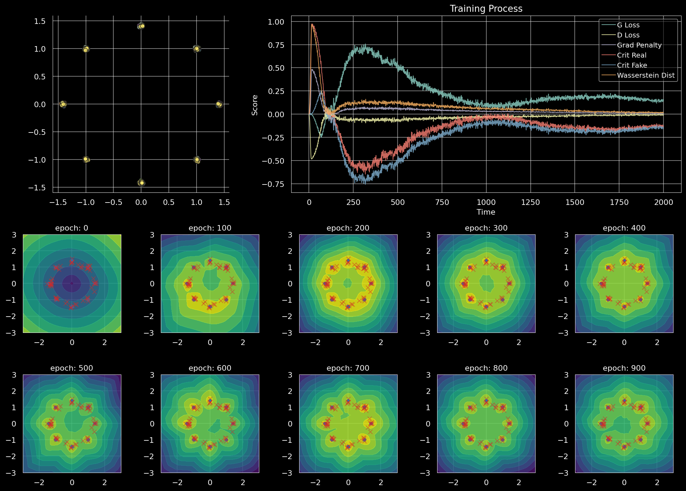
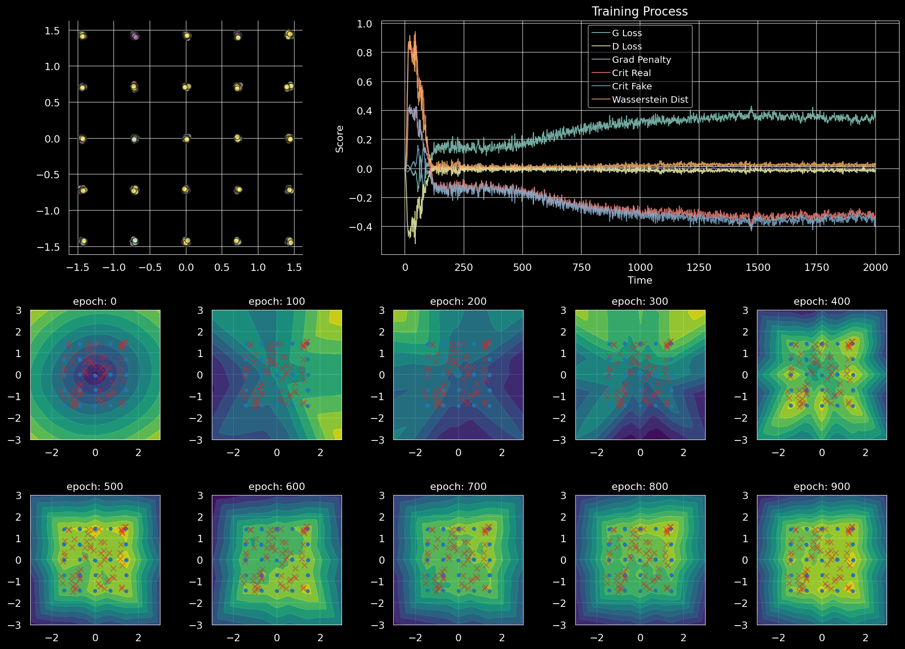
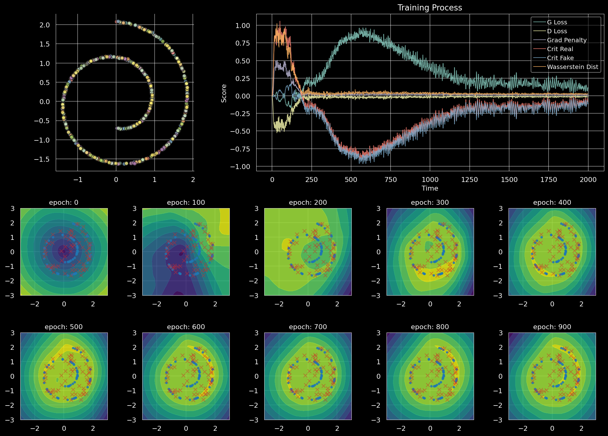

# GAN Experiments

Various GAN experiments with Pytorch.

### [WGAN-GP On Toy Datasets](notebooks/wgan_gp_toy.ipynb)

Gaussian 8

Gaussian 25

Swiss Roll

## References

* [[1704.00028] Improved Training of Wasserstein GANs](https://arxiv.org/abs/1704.00028)
* [[1801.04406] Which Training Methods for GANs do actually Converge?](https://arxiv.org/abs/1801.04406)
* [[1902.03984] Improving Generalization and Stability of Generative Adversarial Networks](https://arxiv.org/abs/1902.03984)
* [[1709.08894] On the regularization of Wasserstein GANs](https://arxiv.org/abs/1709.08894)
* [[1609.04468] Sampling Generative Networks](https://arxiv.org/abs/1609.04468)