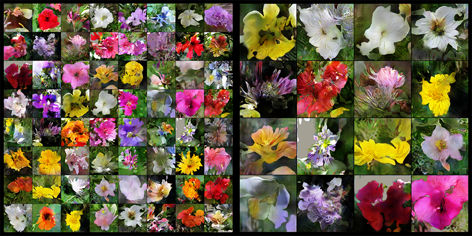

# GAN Experiments

Various GAN experiments with Pytorch.

## Contents

* [WGAN-GP On Toy Datasets](#wgan-gp-on-toy-datasets)
* [DCGAN with GP on MNIST](#dcgan-with-gp-on-mnist)
* [WGAN with Spectral Normalization on Flower102](#wgan-with-spectral-normalization-on-flower102)

## Notebooks

### [WGAN-GP On Toy Datasets](notebooks/wgan_gp_toy.ipynb)

Gaussian 8

Gaussian 25

Swiss Roll

### [DCGAN with GP on MNIST](notebooks/wgan_gp_mnist.ipynb)

### [WGAN with Spectral Normalization on Flower102](notebooks/wgan_specnorm_flower102.ipynb)

### [Stylegan2 Ada On Ukiyoe-faces](notebooks/stylegan2_ada_ukiyoe_faces.ipynb)

### [GANSpace PCA with Stylegan2 Ada On Ukiyoe-faces](notebooks/stylegan2_ganspace.ipynb)

## References

* [[1704.00028] Improved Training of Wasserstein GANs](https://arxiv.org/abs/1704.00028)
* [[1801.04406] Which Training Methods for GANs do actually Converge?](https://arxiv.org/abs/1801.04406)
* [[1902.03984] Improving Generalization and Stability of Generative Adversarial Networks](https://arxiv.org/abs/1902.03984)
* [[1709.08894] On the regularization of Wasserstein GANs](https://arxiv.org/abs/1709.08894)
* [[1609.04468] Sampling Generative Networks](https://arxiv.org/abs/1609.04468)
  * [dribnet/plat](https://github.com/dribnet/plat)
* [[1511.08861] Loss Functions for Neural Networks for Image Processing](https://arxiv.org/abs/1511.08861)
* [[1807.00734] The relativistic discriminator: a key element missing from standard GAN](https://arxiv.org/abs/1807.00734)
* [[1801.03924] The Unreasonable Effectiveness of Deep Features as a Perceptual Metric](https://arxiv.org/abs/1801.03924)
* [[1706.08500] GANs Trained by a Two Time-Scale Update Rule Converge to a Local Nash Equilibrium](https://arxiv.org/abs/1706.08500)
* [[1801.04406] Which Training Methods for GANs do actually Converge?](https://arxiv.org/abs/1801.04406)
* [[1512.09300] Autoencoding beyond pixels using a learned similarity metric](https://arxiv.org/abs/1512.09300)
* [[2002.04185] Smoothness and Stability in GANs](https://arxiv.org/abs/2002.04185)
* [[1705.09367] Stabilizing Training of Generative Adversarial Networks through Regularization](https://arxiv.org/abs/1705.09367)
* [[1802.05957] Spectral Normalization for Generative Adversarial Networks](https://arxiv.org/abs/1802.05957)
* [[2002.03754] Unsupervised Discovery of Interpretable Directions in the GAN Latent Space](https://arxiv.org/abs/2002.03754)
* [[2004.02546] GANSpace: Discovering Interpretable GAN Controls](https://arxiv.org/abs/2004.02546)
